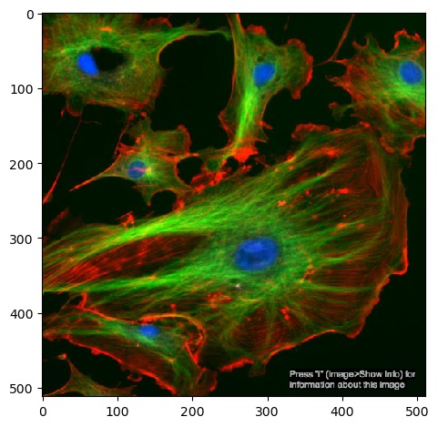
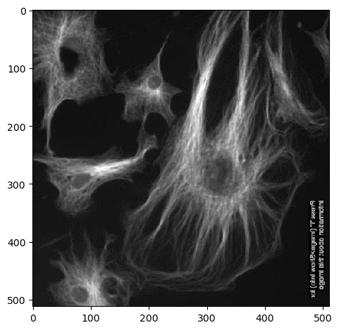
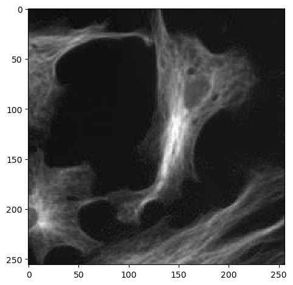
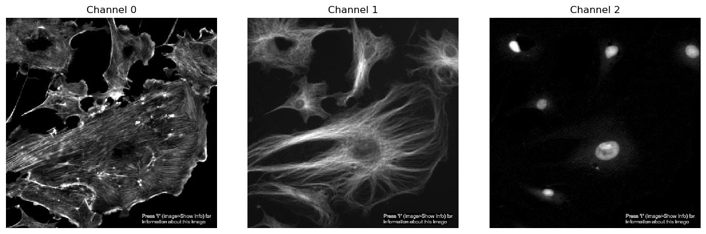
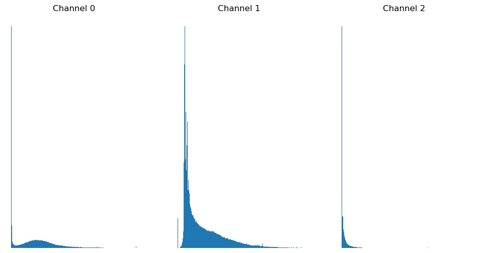
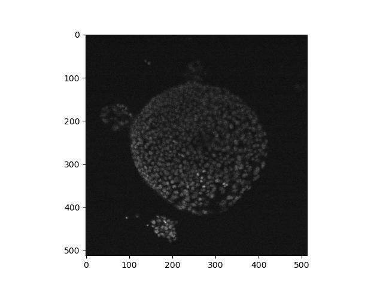
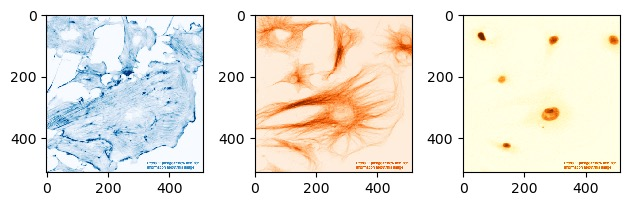

:::::::::::::::::::::::::::::::::::::: questions 
- How do I open an image file in Python for processing?
- How can I explore an image once it's open?
::::::::::::::::::::::::::::::::::::::::::::::::

::::::::::::::::::::::::::::::::::::: objectives
- Open an image with skimage
- Discuss how to open proprietary image formats
- Display an opened image to the screen
::::::::::::::::::::::::::::::::::::::::::::::::

## Opening an image

At its core, an image is a multidimensional array of numbers, and as such can be opened
by programs and libraries designed for working with this kind of data. For Python, one
such library is scikit-image. This library provides a function called `imread` that we
can use to load an image into memory. In a new notebook cell:

```python
from skimage.io import imread
image = imread('data/FluorescentCells_3channel.tif')
```

If you saved your images to a different location, you will need to change the file path
provided to imread accordingly. Paths will be relative to the location of your .ipynb
notebook file.

To view things in Python, usually we use `print()`. However if we try to print this
image to the Jupyter console, instead of the image we get something that may be
unexpected:

```output
> print(image)
array([[[ 16,  50,   0],
        [ 15,  44,   0],
        [ 18,  40,   1],
        ...,
        [  1,  15,   2],
        [  1,  15,   2],
        [  1,  15,   2]]], dtype=uint8)
```

Python has loaded and stored the image as a Numpy `array` object of numbers, and
`print()` displays the string representation or textual form of the data passed
to it, which is why we get a matrix of numbers printed to the screen.

If we want to see what the image looks like, we need tell Python to display it
as an image. We can do this with the `imshow` function from matplotlib, which you
may already be familiar with as a library for drawing plots and graphs, but it can
also display images.

```python
import matplotlib.pyplot as plt

plt.set_cmap('gray')  # by default, single-channel images will now be displayed in greyscale
plt.imshow(image)
```

You should now see the image displayed below the current cell:

{alt='Displaying an image with imshow'}

Since images are multi-dimensional arrays of numbers, we can apply statistical functions
to them and extract some basic metrics. Numpy arrays have methods for several of these
already, including the image's shape, data type and minimum/maximum values:

```python
print(image.shape, image.dtype, image.min(), image.max())
# returns: (512, 512, 3) uint8 0 255
```

This shows that the image has a data type of uint8, it contains values between
0 and 255 and that it is in three dimensions. We can reasonably infer that the two `512` numbers
are the X and Y axes. The third axis in most cases will represent a number of channels.

We can select a single channel by **indexing** the array:

```python
plt.imshow(image[:, :, 2])
```

Here, we select the entire X and Y axes using `:` with no numbers around them, and
the last channel (remember that Python counts from 0).


## Channels, series and stacks

Images can consist of more than two axes. The first two axes are usually X and Y, but if there
is a third axis, then this could be one of several things:

- **Channel** - the image shows different features in the same 2D space. One common example is
  cell images with different staining for nuclei and membranes, expressed as different colours.
- **Time series** - the image is a collection of 2D frames taken at different points in time.
- **Z-stack** - essentially a series of 2D images piled up on top of each other in 3D space.

It's usually easy enough to tell that you're looking at a colour channel from looking at the
image directly, but it may be more difficult to to distinguish a Z or a timepoint axis from
the data alone. If you don't know exactly how the images were generated, it's a good idea to
consult documentation or metadata.

::::::::::::::::::::::::::::::::::::: challenge
## Exercise 1: Loading an image

Load the test image 'FluorescentCells_3channel.tif':

- Try the same as the example above, but display one of the other channels
- Save your single channel to a variable. What happens if you run `imshow` on
  `channel.T`?
- How can we select part of the image, i.e. crop it? Remember that to do this,
  we need to select a subset of the X and/or Y axes.

:::::::::::::::::::::::: solution
Other channels can be loaded with `image[:, :, x]`, where `image` is the variable
the image is saved to and `x` is the index of a channel to retrieve.

Next we can use `.T` to return a **transposed** version of the image. Running
`imshow()` on this results in an image that is flipped 90°:

```python
channel = image[:, :, 1]
plt.imshow(channel.T)
```

{alt='Transposed image'}

Remember that Numpy arrays can be sliced and indexed the same way as lists, strings and
tuples. Up to this point we've been using `:` to select an entire axis, but we can
give it start and end bounds to select part of the X and Y axes, like:

```python
image[:256, 128:384, 1]
```

{alt='2-dimensional slice'}
:::::::::::::::::::::::::::::::::
::::::::::::::::::::::::::::::::::::::::::::::::


Numpy arrays have many more methods available for checking them. Here are just a few to
start with:

### Pixel value statistics

- [`image.mean()`](https://numpy.org/doc/stable/reference/generated/numpy.ndarray.mean.html)
- [`image.min()`](https://numpy.org/doc/stable/reference/generated/numpy.ndarray.min.html)
- [`image.max()`](https://numpy.org/doc/stable/reference/generated/numpy.ndarray.max.html)
- [`image.std()`](https://numpy.org/doc/stable/reference/generated/numpy.ndarray.std.html)

### Image size

[`image.shape`](https://numpy.org/doc/stable/reference/generated/numpy.ndarray.shape.html)

### Object size

[`image.nbytes`](https://numpy.org/doc/stable/reference/generated/numpy.ndarray.nbytes.html)

Note that some of these are functions and need to be called with brackets(`()`), whereas others are
simply attributes that do not.

::::::::::::::::::::::::::::::::::::: challenge
## Exercise 2: Memory check

How much memory did it take to load FluorescentCells_3channel.tif?

:::::::::::::::::::::::: solution
Running `image.nbytes` shows that it takes up 786432 bytes, or ~786 kilobytes, or ~0.7 megabytes.
:::::::::::::::::::::::::::::::::
::::::::::::::::::::::::::::::::::::::::::::::::


## Displaying one channel at a time

We've seen from exercise 1 that we can view single channels by indexing the array. We can also show all
channels together using a matplotlib figure:

```python
import matplotlib.pyplot as plt
plt.figure(figsize=(12, 6))  # figure size, in inches
nchannels = 3

for i in range(nchannels):
    # Use subplot() to create a multi-image figure with 1 row and 3 columns. We need to increment i by 1
    # because range() counts from 0 but subplot() assumes you're counting from 1.
    plt.subplot(1, nchannels, i+1)
    plt.imshow(image[:, :, i])
    plt.title('Channel %s' % i)  # add a plot title
    plt.axis(False)              # we just want to show the image, so turn off the axis labels

plt.show()
```

{alt='All image channels'}


## Histograms

Another useful metric in image analysis is an image's histogram. This can be plotted by flattening
the image and passing it to matplotlib:

```python
plt.hist(image[:, :, 0].flatten(), bins=256)
```

First, we need to select a single channel - since different channels may represent different cell organelles
or points in time, we need to ensure that we are comparing like with like. We also need `flatten()` because
we don't care about the arrangement of the pixels, we just want to sort their values values into bins. Finally,
we can use `bins` to control how many bins the data is split into.

::::::::::::::::::::::::::::::::::::: challenge
## Exercise 3: Histograms

Combine the usage of `matplotlib.pyplot.hist()` and `matplotlib.pyplot.figure()`
introduced above above and plot a histogram of each of the three channels in
FluorescentCells_3channel.tif.

:::::::::::::::::::::::: solution

Starting with displaying a single histogram for one channel:

```python
channel_idx = 0
channel = image[:, :, channel_idx]
plt.hist(channel.flatten(), bins=255)
plt.title('Channel %s' % channel_idx)
plt.show()
```

We could call this three times, each with a different value for `channel_idx`, or we can use
a **for loop**:

```python
plt.figure(figsize=(12, 6))  # figure size, in inches
nchannels = image.shape[-1]

for i in range(nchannels):
    channel = image[:, :, i]

    plt.subplot(1, nchannels, i+1)
    plt.hist(channel.flatten(), bins=255)
    plt.title('Channel %s' % i)  # add a plot title

plt.show()
```
{alt='All image channels'}

:::::::::::::::::::::::::::::::::
::::::::::::::::::::::::::::::::::::::::::::::::


## Proprietary formats

Images can come in many formats, but for many of the common ones such as TIFF,
PNG and BMP, skimage is smart enough to know how to read each one.

Some image formats are associated with specific instruments or equipment and
require specialised packages to open. Depending on your system, these may
already be available via `import` the same as any other Python package. If
not, then these should be installed into whatever Python instance you are
using.

If using JupyterHub or JupyterLab, go to 'New' -> 'Terminal'. This will open
a shell session in a new browser tab, where you can run `pip install` commands.

### Carl Zeiss .czi

Images in .czi format can be opened with the `czifile` library. In the Terminal
you opened above:

    $ pip install czifile

### Nikon .nd2

    $ pip install nd2

### Imaris .ims

    $ pip install imaris-ims-file-reader

### Leica .lif

    $ pip install readlif


::::::::::::::::::::::::::::::::::::: challenge
## Exercise 4: Proprietary formats

Load the [nd2](https://www.talleylambert.com/nd2/#installation) package and use it to read
the test file 'Ersi_organoid_WT2.nd2'. Install it if you need to.

What axes are present in the image? Which look most likely to be the X and
Y axes? Use `imshow` to display a single frame from the image.

:::::::::::::::::::::::: solution
If not already present, the nd2 package can be installed in the Terminal with
`pip install nd2`. According to its linked documentation, it has
an `imread` function that works in a similar way to the one in skimage, and returns a numpy
multidimensional array that we can work with the same way we have before:

```python
import nd2
image = nd2.imread('data/Ersi_organoid_WT2.nd2')
image.shape
# returns: (27, 3, 512, 512)
```

`img.shape` shows that there are four axes, `(27, 3, 512, 512)`. The latter two numbers look like
the X and Y axes, while the second number looks like a number of colour channels. The first number
looks like either a time series or a Z axis. We can show a single frame with:

```python
plt.imshow(image[0, 0, :, :])
```

{alt='ND2 image'}

:::::::::::::::::::::::::::::::::
::::::::::::::::::::::::::::::::::::::::::::::::

As discussed above in exercise 4, it may be difficult to distinguish a time series from a Z axis.
You may also notice that here the X/Y axes are the latter two numbers, but in other examples
above, the X/Y axes were the first two. This demonstrates the diversity and general lack of
consistency in image formatting, and how it's usually a good idea to find out as much as you can
about the image from documentation and metadata before processing it.

## Altering the lookup table

Now that we've been able to open an image, we can start to explore it and display
it in different ways.

The `imshow()` function can take extra arguments in addition to the image to display. One
of these is called `cmap`, which can apply alternate lookup tables (a.k.a. colour maps):

```python
plt.imshow(image[0, 0, :, :], cmap='viridis')
```

Skimage uses lookup tables from the plotting library matplotlib. A list of available tables
can be obtained with:

```python
from matplotlib import colormaps
print(sorted(colormaps))
```

::::::::::::::::::::::::::::::::::::: challenge
## Exercise 5: Lookup tables

Go back to the FluorescentCells_3channel.tif image. Display each of its three channels side
by side in a matplotlib figure, each in a different colour using `cmap=`. Use the values in
`matplotlib.colormaps` to select a lookup table for each one.

:::::::::::::::::::::::: solution
There will be many ways to do this (and many colour maps to choose from!), but here
is one possible solution:

```python
# you'll need to run this again if you overwrote your `image` variable
image = imread('data/FluorescentCells_3channel.tif')
plt.figure(figsize=(12, 6))

plt.subplot(1, 3, 1)
plt.imshow(image[:, :, 0], cmap='Blues')

plt.subplot(1, 3, 2)
plt.imshow(image[:, :, 1], cmap='Oranges')

plt.subplot(1, 3, 3)
plt.imshow(image[:, :, 2], cmap='YlOrBr')
```

{alt='ND2 image'}

:::::::::::::::::::::::::::::::::

Load hela-cells_rgb.tif and try displaying it with different lookup tables. What results do
you get? Why might this be the case?

:::::::::::::::::::::::: solution
The resulting image will not look as expected, and in Jupyter the image will appear unchanged.
In this case, since the lookup table is being ignored, this would imply that the pixel values
do not represent light intensities but rather are explicitly encoded colour values - i.e. it's
an RGB image.
:::::::::::::::::::::::::::::::::
::::::::::::::::::::::::::::::::::::::::::::::::

## Other notes

### Rearranging channels

You may find yourself in a situation where the arrangement of dimensions in your image
is incorrect for the processing you wish to perform on it - maybe a function requires
that an image be oriented in a particular way. This is where it's useful to be able
to rearrange the dimensions of an image. To do this, we can use Numpy's `moveaxis`
function:

```python
import numpy
image = imread('data/FluorescentCells_3channel.tif')
print(image.shape)
# returns: (800, 800, 3)
rearranged_image = numpy.moveaxis(image, -1, 0)
print(rearranged_image.shape)
# returns: (3, 800, 800)
print(image.shape)
# returns: (800, 800, 3)
```

We can see that calling `moveaxis` on an array gives us a rearranged version of the
array given to it - the channel axis that was at the end is now at the front. However,
we can see that the original value of the image is unchanged. This is because by default,
`moveaxis` returns a rearranged **copy** of the image.

The arguments supplied are:

- The image or array
- The current position of the dimension to move
- The position to move that dimension to

In this case, we are moving the dimension at position -1 (i.e. the one at the end) to
position 0 (the start).

### Pixel size

Pixels are an approximation of an object - knowing that something is 50 pixels long and
50 pixels wide doesn't tell us anything about its actual size. To make any real-world
measurements on the image, we need the image's **pixel size**.

To get this, it is necessary to read the image's **metadata**. For this we need a different
library, imageio. There are a couple of different places we can look:

```python
import imageio
meta = imageio.v3.immeta('data/FluorescentCells_3channel.tif')
props = imageio.v3.improps('data/FluorescentCells_3channel.tif')
print('meta:', meta)
print('props:', props)
```

`immeta()` gives us a dict summarising the image, and `improps` gives an object with the
property 'spacing'. However, there is no guarantee that wither of these will contain any
information on pixel size, and the BioimageBook notes that
[these numbers can be misleading](https://bioimagebook.github.io/chapters/1-concepts/5-pixel_size/python.html#imageio)
and require interpretation and cross-checking.

Even if `immeta()` does return a key called 'unit', the value may be returned as escaped Unicode:

    'unit': '\\u00B5m'

This can be un-escaped with:

    >>> m['unit'].encode().decode('unicode-escape')
    μm

Here, this would indicate that the image is to be mesaured in micrometres. Combining this
with other information that may be available, e.g. `improps().spacing`, will help you figure
out the pixel size.

::::::::::::::::::::::::::::::::::::: keypoints
- Common image formats can usually all be loaded in the same way with skimage
- Specialised proprietary formats may require specialised libraries
- Basic metrics of an image include histogram, shape and max/min pixel values
- These metrics can help tell us how the miage should be analysed
- Lookup tables can change how a single-channel image is rendered
- An RGB image contains 3 channels for red, green and blue
::::::::::::::::::::::::::::::::::::::::::::::::
