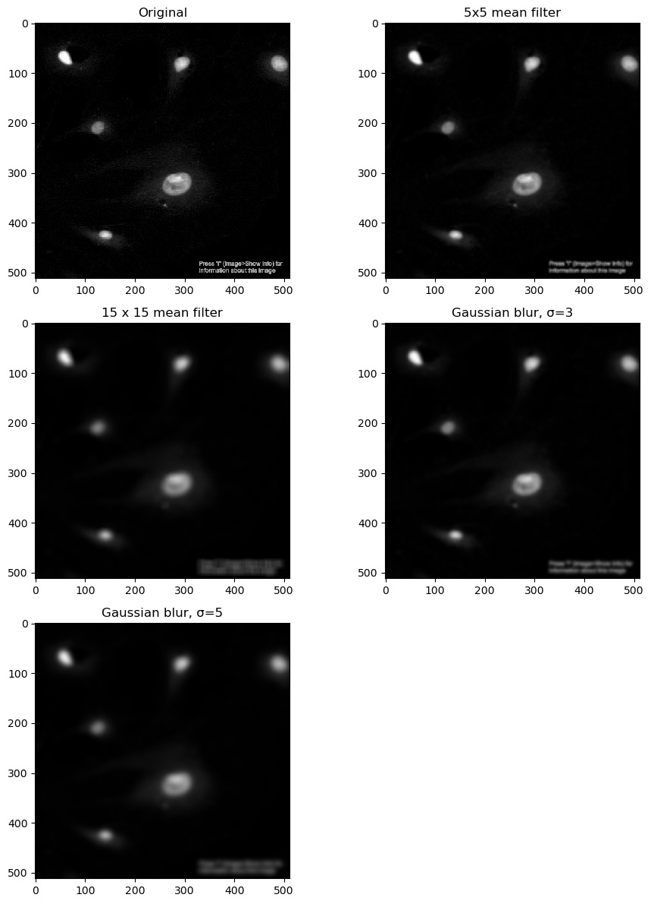
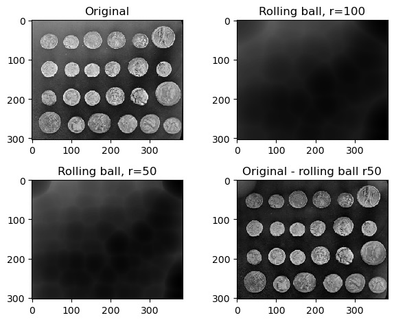
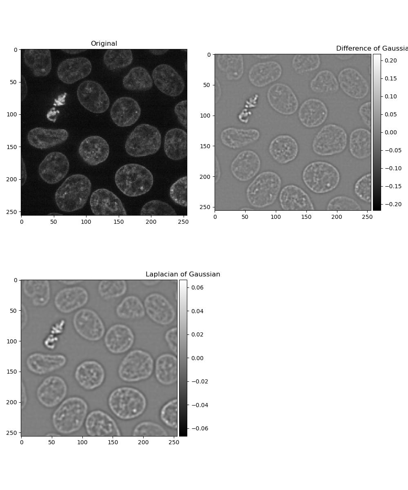

---

title: 'Applying Filters'
teaching: 40
exercises: 3
---

:::::::::::::::::::::::::::::::::::::: questions
- How can I make it possible to isolate features in my images?
::::::::::::::::::::::::::::::::::::::::::::::::

::::::::::::::::::::::::::::::::::::: objectives
- Apply mean and Gaussian filters to an image
- Select one of these filtered images to use for processing in subsequent chapters
::::::::::::::::::::::::::::::::::::::::::::::::

## Filters

Images often need to have noise removed in order for the results of further
processing to be meaningful. There are many smoothing filters available, each
with their own advantages depending on the situation and the image in question.
Here are two to get started:

- [mean filter](https://scikit-image.org/docs/stable/api/skimage.filters.rank.html#skimage.filters.rank.mean)
- [Gaussian filter](https://scikit-image.org/docs/stable/api/skimage.filters.html#skimage.filters.Gaussian)

A mean filter will, for each pixel:

  - Create a **kernel** of pixels around it, in a size/shape of the user's choosing
  - Take the mean of all pixels within this kernel
  - Assign this new value to the pixel

The kernel in this case can be considered analogous to a 2-dimensional sliding window.

A Gaussian filter is similar to a mean filter, except that pixels near the centre of
the kernel will have a greater effect on the result.

You can create a kernel with skimage:

```python
from skimage.morphology import square
kernel = square(3)  # create a 3x3 square kernel
```

There are other shapes of kernel that can be used, and are documented
[here](https://scikit-image.org/docs/stable/api/skimage.morphology.html).

Note that as of skimage 0.25.0, the `square` function has been deprecated in
favour of a new function, [footprint_rectangle](https://scikit-image.org/docs/stable/api/skimage.morphology.html#skimage.morphology.footprint_rectangle):

```python
from skimage.morphology import footprint_rectangle
kernel = square((3, 3))  # also a 3x3 square kernel
```

::::::::::::::::::::::::::::::::::::: challenge 
## Exercise 6: Applying filters

Look at the documentation pages for the mean and Gaussian filters above. Load a frame from the second channel
of the test image [skimage.data.cells3d](https://scikit-image.org/docs/stable/api/skimage.data.html#skimage.data.cells3d):

```python
from skimage.data import cells3d

image = cells3d()[30, 1, :, :]
```

Build a figure displaying this image in each of the following forms:

- original image
- mean filter using a 3x3 square kernel
- mean filter using a 9x9 square kernel
- Gaussian filter of sigma = 1
- Gaussian filter of sigma = 5

How do the different methods compare?

:::::::::::::::::::::::: solution
```python
from skimage.data import cells3d
from skimage.filters import gaussian
from skimage.filters.rank import mean
from skimage.morphology.footprints import square

image = cells3d()[30, 1, :, :]
plt.figure(figsize=(10, 12))

plt.subplot(3, 2, 1)
plt.imshow(image)
plt.title('Original')

plt.subplot(3, 2, 2)
plt.imshow(mean(image, footprint=square(3)))
plt.title('3x3 mean filter')

plt.subplot(3, 2, 3)
plt.imshow(mean(image, footprint=square(9)))
plt.title('9x9 mean filter')

plt.subplot(3, 2, 4)
plt.imshow(gaussian(image, sigma=1))
plt.title('Gaussian blur, σ=1')

plt.subplot(3, 2, 5)
plt.imshow(gaussian(image, sigma=5))
plt.title('Gaussian blur, σ=5')
```

{alt='Filters'}

Larger kernels and sigma values will result in a greater smoothing
effect and a more blurred image - as you can see, it is possible to
over-blur the image.
:::::::::::::::::::::::::::::::::
:::::::::::::::::::::::::::::::::::::::::::::::

## Removing the background

Eventually we're going to want to isolate the foreground from the background. In some
images, this may be difficult especially if the two are not entirely distinct from each
other, or if the background is not a uniform shade. In cases like this, a rolling ball
algorithm can be applied. The rolling ball estimates the background intensity of an
image by using the pixel values to translate the image into a height map, and then
rolling a ball of a given radius across it. Additional information on how it works
can be found [here](https://www.researchgate.net/figure/Schematic-diagram-of-background-subtraction-by-the-rolling-ball-method-the-histogram_fig3_319985119).

::::::::::::::::::::::::::::::::::::: challenge
## Exercise 7: Rolling ball background intensity

Look at the [scikit-image documentation](https://scikit-image.org/docs/stable/auto_examples/segmentation/plot_rolling_ball.html)
on the rolling ball filter. Load the example image [skimage.data.coins](https://scikit-image.org/docs/stable/api/skimage.data.html#skimage.data.coins)
and display:

- the original image
- image with a rolling ball of radius 100 applied
- image with a rolling ball of radius 50 applied
- the image with the radius=50 rolling ball subtracted from it

:::::::::::::::::::::::: solution 

Compute time can be found using Python's datetime library:

```python
from skimage.data import coins
from skimage.restoration import rolling_ball

image = coins()
plt.figure(figsize=(10, 8))

plt.subplot(2, 2, 1)
plt.imshow(image, cmap='gray')
plt.title('Original')

plt.subplot(2, 2, 2)
rolling_ball_100 = rolling_ball(image, radius=100)
plt.imshow(rolling_ball_100, cmap='gray')
plt.title('Rolling ball, r=100')

plt.subplot(2, 2, 3)
rolling_ball_50 = rolling_ball(image, radius=50)
plt.imshow(rolling_ball_50, cmap='gray')
plt.title('Rolling ball, r=50')

plt.subplot(2, 2, 4)
plt.imshow(image - rolling_ball_50)
plt.title('Original - rolling ball r50')
```

{alt='Rolling ball'}

:::::::::::::::::::::::::::::::::
:::::::::::::::::::::::::::::::::::::::::::::::

## Dogs and logs

Difference of Gaussian (DoG) and Laplacian of Gaussian (LoG) are algorithms that build on
the Gaussian filter.

In a [Difference of Gaussian](https://scikit-image.org/docs/stable/api/skimage.filters.html#skimage.filters.difference_of_gaussians),
two Gaussian filters are taken of the image, each with a different sigma value.
The larger filter is then subtracted from the first to give an image where
features are effectively highlighted by an area of high contrast.

In a Laplacian of Gaussian, a Gaussian-filtered image is supplied to a
[Laplace](https://scikit-image.org/docs/stable/api/skimage.filters.html#skimage.filters.laplace)
filter. This eliminates the need to manually select two sigma values as with Difference of Gaussian.

::::::::::::::::::::::::::::::::::::: challenge
## Exercise 8: Dogs and logs

Load a frame from the second channel of [skimage.data.cells3d()](https://scikit-image.org/docs/stable/api/skimage.data.html#skimage.data.cells3d)
again:

```python
from skimage.data import cells3d

image = cells3d()[30, 1, :, :]
```

Display a figure of:

- The original image
- Image with a Difference of Gaussians applied with sigma values 2 and 4
- Image with a Laplacian of Gaussians applied. Note that the Laplace filter linked
  above does not perform the Gaussian filter for you, so you will need to pass the
  image through `gaussian()` first.

:::::::::::::::::::::::: solution 

```python
from skimage.data import cells3d
from skimage.filters import gaussian, difference_of_gaussians, laplace

image = cells3d()[30, 1, :, :]
plt.figure(figsize=(10, 12))

plt.subplot(2, 2, 1)
plt.imshow(image)
plt.title('Original')

plt.subplot(2, 2, 2)
plt.imshow(difference_of_gaussians(image, 1, 2), cmap='gray')
plt.title('Difference of Gaussians')

plt.subplot(2, 2, 3)
plt.imshow(laplace(gaussian(image, sigma=2)), cmap='gray')
plt.title('Laplacian of Gaussian')
```

{alt='Dogs and logs'}

:::::::::::::::::::::::::::::::::

## Exercise 9: Choosing a filter

Look at the images you produced in exercises 6 and 8, and select one to use in
subsequent chapters for thresholding and segmentation!
:::::::::::::::::::::::::::::::::::::::::::::::

::::::::::::::::::::::::::::::::::::: keypoints 
- There are many ways of smoothing an image
- Different methods will perform better in different situations
::::::::::::::::::::::::::::::::::::::::::::::::
