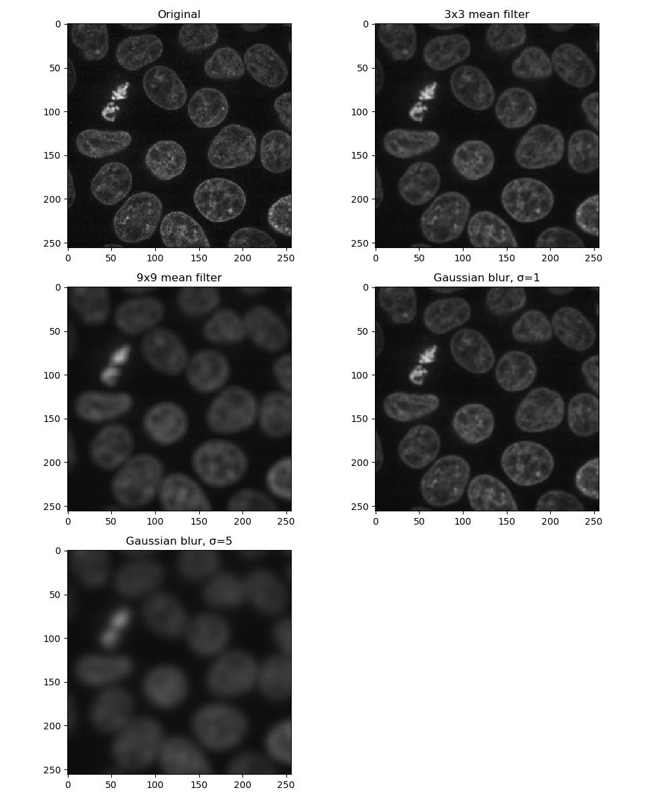

:::::::::::::::::::::::::::::::::::::: questions
- How can I make it possible to isolate features in my images?
::::::::::::::::::::::::::::::::::::::::::::::::

::::::::::::::::::::::::::::::::::::: objectives
- Apply mean and Gaussian filters to an image
- Select one of these filtered images to use for processing in subsequent chapters
- Todo: Discuss Difference of Gaussian and Laplacian of Gaussian algorithms
::::::::::::::::::::::::::::::::::::::::::::::::

## Filters

Images often need to have noise removed in order for the results of further
processing to be meaningful. There are many smoothing filters available, each
with their own advantages depending on the situation and the image in question.
Here are two to get started:

- [mean filter](https://scikit-image.org/docs/stable/api/skimage.filters.rank.html#skimage.filters.rank.mean)
- [Gaussian filter](https://scikit-image.org/docs/stable/api/skimage.filters.html#skimage.filters.Gaussian)

A mean filter will, for each pixel:

  - Create a kernel of pixels around it, in a size/shape of the user's choosing
  - Take the mean of all pixels within this kernel
  - Assign this new value to the pixel

The kernel in this case can be considered analogous to a 2-dimensional sliding window.

A Gaussian filter is similar to a mean filter, except that pixels near the centre of
the kernel will have a greater effect on the result.

::::::::::::::::::::::::::::::::::::: challenge 
## Exercise 7: Applying filters

Look at the documentation pages for the mean and Gaussian filters above. Load the last channel
of FluorescentCells_3channel.tif containing the nuclei, and build a figure displaying it in each
of the following forms:

- original image
- 5x5 square mean filter applied
- 15x15 square mean filter
- Gaussian filter of sigma = 3
- Gaussian filter of sigma = 5

How do the different methods compare?

:::::::::::::::::::::::: solution
```python
img = imread('data/FluorescentCells_3channel.tif')[:, :, -1]

plt.figure(figsize=(10, 12))
plt.subplot(3, 2, 1)
plt.imshow(img)
plt.title('Original')

plt.subplot(3, 2, 2)
mean5x5 = skimage.filters.rank.mean(img, skimage.morphology.square(5))
plt.plt.imshow(mean5x5)
title('5x5 mean filter')

plt.subplot(3, 2, 3)
mean15x15 = skimage.filters.rank.mean(img, skimage.morphology.square(15))
plt.imshow(mean15x15)
plt.title('15 x 15 mean filter')

plt.subplot(3, 2, 4)
gauss3 = skimage.filters.gaussian(img, 3)
plt.imshow(gauss3)
plt.title('Gaussian blur, σ=3')

plt.subplot(3, 2, 5)
gauss5 = skimage.filters.gaussian(img, 5)
plt.imshow(gauss5)
plt.title('Gaussian blur, σ=5')
```

{alt='Filters'}

Larger mean kernels and sigma values will result in a greater smoothing
effect and a more blurred image.
:::::::::::::::::::::::::::::::::
:::::::::::::::::::::::::::::::::::::::::::::::

## Removing the background

Sometimes when we're trying to isolate the foreground from the background, the two
are not entirely distinct from each other. In cases like this, a rolling ball
algorithm can be applied. The rolling ball estimates the background intensity of an
image by using the pixel values to translate the image into a height map, and then
rolling a ball of a given radius across it. Additional information on how it works
can be found [here](https://www.researchgate.net/figure/Schematic-diagram-of-background-subtraction-by-the-rolling-ball-method-the-histogram_fig3_319985119).

::::::::::::::::::::::::::::::::::::: challenge
## Exercise 8: Rolling ball background intensity

Look at the [scikit-image documentation](https://scikit-image.org/docs/stable/auto_examples/segmentation/plot_rolling_ball.html)
on the rolling ball filter. Load the example image `skimage.data.coins` and display:

- the original image
- image with a rolling ball of radius 100 applied
- image with a rolling ball of radius 50 applied
- the image with the radius=50 rolling ball subtracted from it

How long does it take to compute?

:::::::::::::::::::::::: solution 

Compute time can be found using Python's datetime library:

```python
import datetime
import skimage
import matplotlib.pyplot as plt

img = skimage.data.coins()
t0 = datetime.datetime.now()

plt.subplot(2, 2, 1)
plt.imshow(img)
t1 = datetime.datetime.now()
plt.title('Original')

plt.subplot(2, 2, 2)
rolling_ball_100 = skimage.restoration.rolling_ball(img, radius=100)
plt.imshow(rolling_ball_100)
t2 = datetime.datetime.now()
plt.title('Rolling ball, r=100')

plt.subplot(2, 2, 3)
rolling_ball_50 = skimage.restoration.rolling_ball(img, radius=50)
plt.imshow(rolling_ball_50)
t3 = datetime.datetime.now()
plt.title('Rolling ball, r=50')

plt.subplot(2, 2, 4)
plt.imshow(img - rolling_ball_50)
plt.title('Original - rolling ball r50')

plt.show()
print('Original image:', t1 - t0)
print('Rolling ball 100: ', t2 - t1)
print('Rolling ball 50:', t3 - t2)
print('Total:', t3 - t0)
```

{alt='Rolling ball'}

:::::::::::::::::::::::::::::::::
:::::::::::::::::::::::::::::::::::::::::::::::

## Dogs and logs

Difference of Gaussian (DoG) and Laplacian of Gaussian (LoG) are algorithms that build on
the Gaussian filter.

In a [Difference of Gaussian](https://scikit-image.org/docs/stable/api/skimage.filters.html#skimage.filters.difference_of_gaussians),
two Gaussian filters are taken of the image, each with a different sigma value.
The larger filter is then subtracted from the first to give an image where image
features are effectively highlighted by an area of high contrast.

In a Laplacian of Gaussian, a Gaussian-filtered image is supplied to a
[Laplace](https://scikit-image.org/docs/stable/api/skimage.filters.html#skimage.filters.laplace)
filter. This eliminates the need to manually select two sigma values as with Difference of Gaussian.

::::::::::::::::::::::::::::::::::::: challenge
## Exercise 9: Dogs and logs

Load the image 'Ersi_organoid_WT2.nd2' and select the end channel of the 16th
frame, i.e. `img[15, 2, :, :]`. Display a figure of:

- The original image
- Image with a Difference of Gaussians applied with sigma values 2 and 4
- Image with a Laplacian of Gaussians applied. Note that the Laplace filter linked
  above does not perform the Gaussian filter for you.

:::::::::::::::::::::::: solution 

```python
plt.subplot(1, 3, 1)
imshow(img[15, 2, :, :])

plt.subplot(1, 3, 2)
imshow(skimage.filters.difference_of_gaussians(img[15, 2, :, :], 2, 4))

plt.subplot(1, 3, 3)
imshow(skimage.filters.laplace(img[15, 2, :, :]))
```

{alt='Dogs and logs'}

:::::::::::::::::::::::::::::::::

## Exercise 10: Choosing a filter

Look at the images you produced in exercises 7 and 9, and select one to use in
subsequent chapters for thresholding and segmentation!
:::::::::::::::::::::::::::::::::::::::::::::::

::::::::::::::::::::::::::::::::::::: keypoints 
- There are many ways of smoothing an image
- Different methods will perform better in different situations
::::::::::::::::::::::::::::::::::::::::::::::::
