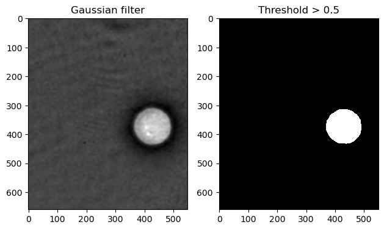
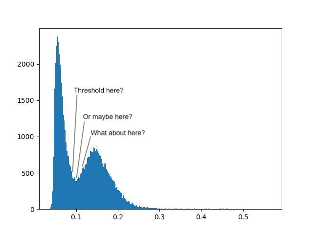
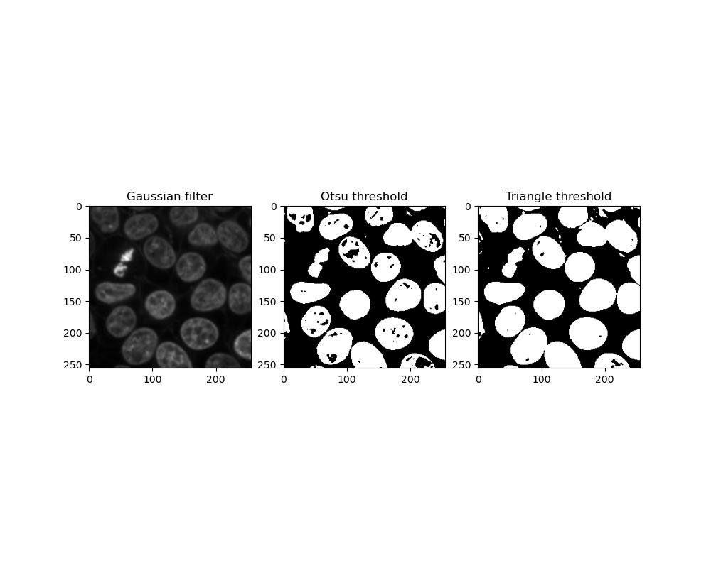
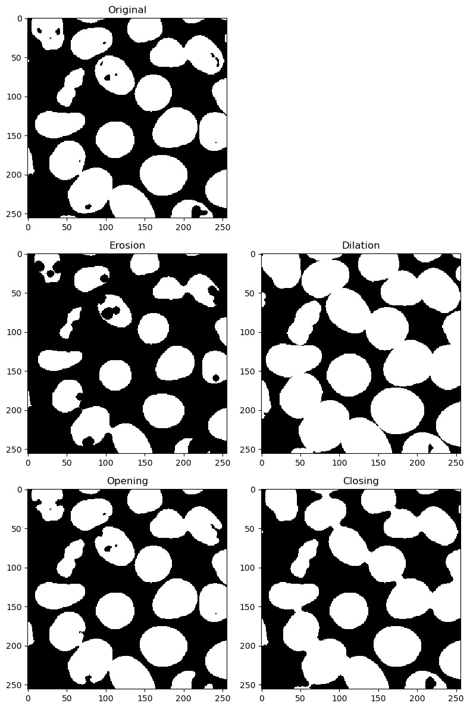
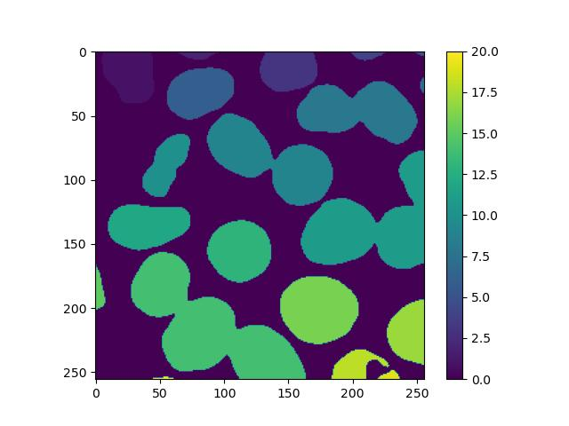
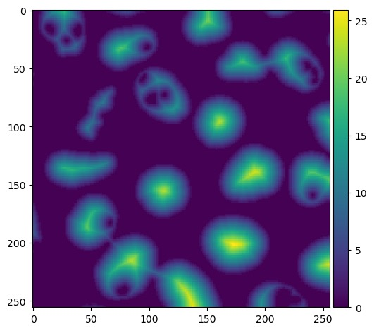
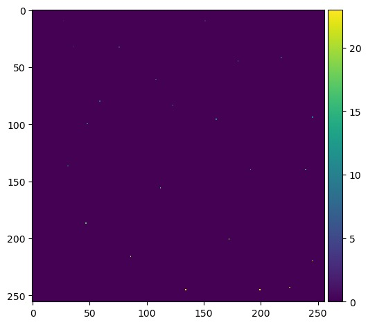
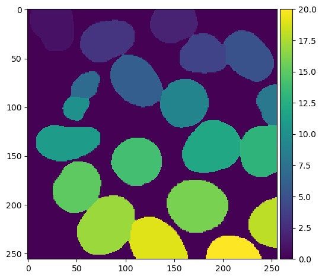

:::::::::::::::::::::::::::::::::::::: questions 
- How can I isolate features of interest in my image?
- How can I uniquely label features once I've found them?
::::::::::::::::::::::::::::::::::::::::::::::::

::::::::::::::::::::::::::::::::::::: objectives
- Apply various thresholds an image
- Quantify features of interest in an image
- Demonstrate how to deal with edge cases like features stuck together
::::::::::::::::::::::::::::::::::::::::::::::::

These exercises will make use of the image you decided to use in exercise 10.

## Thresholding

Thresholding consists of converting an image into binary form (i.e. **binarising**
it), where each pixel value is converted to either 0 or 1 depending on whether it
exceeds a given threshold.

We can binarise an image with a given threshold by applying the `>` operator to it.
It's common practice to smooth the image first, e.g. with a Gaussian filter:

    img = skimage.filters.gaussian(skimage.data.cell())
    print(img.min(), img.max(), img.dtype)

    plt.subplot(1, 2, 1)
    plt.imshow(img)
    plt.title('Gaussian filter')

    plt.subplot(1, 2, 2)
    binary_img = img > 0.5
    plt.imshow(binary_img)
    plt.title('Threshold > 0.5')

{alt='Threshold'}

Applying a set number to an image as a threshold is simple, but it's not ideal
having to guess an appropriate threshold until we get a sensible one. Looking at
the histogram helps, but still requires some manual interpretation and human
subjectivity:

    hist(img.flatten(), bins=100)

{alt='Histogram'}

Fortunately, there are several algorithms for automatically determining an appropriate
threshold based on the image's histogram. **Global** thresholds work on the entire
image, whereas **local** thresholds work on a window around each pixel - this course will
deal only with global filters.

::::::::::::::::::::::::::::::::::::: challenge
## Exercise 11: Thresholds

Look at the [skimage filter docs](https://scikit-image.org/docs/stable/api/skimage.filters.html)
and find each of the following threshold algorithms:

- Otsu threshold
- Triangle threshold

Try running each of these algorithms on your image from exercise 10, and apply the
resulting threshold on it. How do the results differ?

:::::::::::::::::::::::: solution 

We can display the two threshold algorithms in a figure:

```python
plt.subplot(2, 2, 1)
plt.imshow(skimage.filters.gaussian(img))
plt.title('Gaussian filter')

# Otsu threshold
plt.subplot(2, 2, 3)
threshold = skimage.filters.threshold_otsu(img)
plt.imshow(img > threshold)
plt.title('Otsu threshold')

# Triangle threshold
plt.subplot(2, 2, 4)
threshold = skimage.filters.threshold_triangle(img)
plt.imshow(img > threshold)
plt.title('Triangle threshold')
```

{alt='Otsu and Triangle thresholds'}

Which threshold performs better can depend on the image you have. Otsu
thresholding is less sensitive so foreground objects are more likely to
be incomplete or have holes in them, whereas triangle thresholding has
a greater tendency for close foreground objects to become stuck together.

:::::::::::::::::::::::::::::::::
:::::::::::::::::::::::::::::::::::::::::::::::

## Cleaning up

Once we have a binary image, we may still need to clean it up further. There may
still be extraneous pixels and other bits around the regions of interest, or there
may be holes in a shape that you need to be solid.

::::::::::::::::::::::::::::::::::::: challenge
## Exercise 12: Erosion, dilation, opening and closing

Look at the [skimage morphology docs](https://scikit-image.org/docs/stable/api/skimage.morphology.html).
Select one of your binary images from exercise 11 and apply each of the following algorithms to the image:

  - Binary erosion
  - Binary dilation
  - Binary opening
  - Binary closing

Note: each of the algorithms above will require a kernel or footprint. For this,
use a disc-shaped kernel of radius 4:

    kernel = skimage.morphology.disk(4)

:::::::::::::::::::::::: solution
```python

plt.figure(figsize=(8, 12))
kernel = skimage.morphology.disk(4)

# Original image
plt.subplot(2, 3, 1)
plt.imshow(binary_image)

# Erosion
plt.subplot(2, 3, 3)
plt.imshow(skimage.morphology.binary_erosion(binary_image, footprint=kernel))

# Dilation
plt.subplot(2, 3, 4)
plt.imshow(skimage.morphology.binary_dilation(binary_image, footprint=kernel))

# Opening
plt.subplot(2, 3, 5)
plt.imshow(skimage.morphology.binary_opening(binary_image, footprint=kernel))

# Closing
plt.subplot(2, 3, 6)
plt.imshow(skimage.morphology.binary_closing(binary_image, footprint=kernel))
```

{alt='Image transformations'}

Eroding has the effect of shrinking all foreground features. Dilating has the opposite
effect, potentially resulting in foreground features becoming stuck together.

Opening an image is an erosion followed by a dilation. If your image is grainy with
many small artifacts, these will be removed.

Closing is the opposite - dilation followed by erosion. This will have the effect of
filling in any holes in your foreground features.
:::::::::::::::::::::::::::::::::
:::::::::::::::::::::::::::::::::::::::::::::::

If there are still holes in your binary image, there is also a function in
ndimage that will fix this:

    binary_img = scipy.ndimage.binary_fill_holes(binary_img)

{alt='Binary fill holes'}


## Labelling

In some situations, it may be necessary to distinguish between individual
features, e.g. if counting cell nuclei. For this, it is necessary to
isolate or **label** individual separated objects in the foreground:

    labels = skimage.morphology.label(binary_img)
    plt.imshow(labels)
    plt.colorbar()

This will result in an image similar to the binary image supplied, but
instead of just 1s, each feature will have a unique number assigned to
all of its pixels. Displaying this with a colour scale will effectively
colour-code each one:

{alt='Image labelling'}


## Watershed transforms

Sometimes, isolating objects is more complicated, for example when features are stuck
together. To solve this, several transforming or segmentation operations exist:

This transformation requires a few preparation steps. First, we need a
**distance transform** of the binary image, where each foreground pixel's value
is its Euclidean distance to the background. skimage doesn't have a function
for this, but scipy does:

    dt = scipy.ndimage.distance_transform_edt(binary_img)

{alt='Distance transform'}

Next, we need the coordinates of all **local maxima**, i.e. locations that are
furthest away from the background. This requires a kernel/footprint, which in
this example is a square kernel of 7x7:

    coords = skimage.feature.peak_local_max(dt, labels=binary_img)

This gives us a list of coordinates, so we need to convert this back into an
labelled image of maxima. This will be mostly blank with an individually
labelled dot representing each one:

    mask = numpy.zeros(dt.shape, dtype=bool)  # blank image the same size as the original
    mask[tuple(coords.T)] = True              # create a foreground pixel at each set of coordinates
    markers = skimage.morphology.label(mask)  # uniquely label them

{alt='Local maxima'}

Note the `.T` to transpose the maxima coordinates.

At this point depending on your image, you may get clusters of peaks close together
rather than one clean, distinct peak per feature. This is especially likely if your
features are not circular. Applied to the final watershed step below, this will result
in features being split when they shouldn't be. This can be resolved in several ways:

1. Smoothing the distance transform:

    dt = scipy.ndimage.distance_transform_edt(binary_img)
    dt = skimage.filters.gaussian(dt, sigma=4)

2. Applying a larger footprint to peak_local_max:

    coords = skimage.feature.peak_local_max(dt, footprint=numpy.ones((7,7)), labels=binary_img)

3. Providing a `min_distance` argument to peak_local_max, which will prevent the function from identifying peaks
too close together:

    coords = skimage.feature.peak_local_max(dt, min_distance=10, labels=binary_img)

Finally, the transform can be done. One final note is that because of the
[way watershed transforms work](https://bioimagebook.github.io/chapters/2-processing/6-transforms/transforms.html#the-watershed-transform),
we need to convert the distance map from peaks to troughs by inverting it with `-`:

    labels = skimage.segmentation.watershed(-dt, markers, mask=binary_img)

{alt='Masked watershed segmentation'}

::::::::::::::::::::::::::::::::::::: challenge
## Exercise 13: Image segmentation

- Load up your image from exercise 10 and run `skimage.morphology.label`
  on the foreground features
- How many features did skimage find? (hint: try flattening your labelled image)
- Perform a watershed transform on your binary image as above. Try
  displaying the result of each stage of the transform.
- How many features are identified now after watershed transformation?
- Does the watershed transformation work perfectly?

:::::::::::::::::::::::: solution

Labelling applies a unique number to each feature. This means that if we apply
thresholding and labelling to the image, we can flatten the result and cast
it to a set to find all the unique label numbers present, and find the highest
numbered label to get the number of features:

```python
threshold = skimage.filters.threshold_triangle(img)
binary_img = img > threshold

plt.subplot(1, 2, 1)
plt.imshow(binary_img)

labels = skimage.morphology.label(img)
plt.subplot(1, 2, 2)
plt.imshow(labels)

flat = labels.flatten()
print(set(flat))
print(max(flat))
```

However, we see from the intermediate images that multiple touching
nuclei are treated as a single feature.

Here is an example of using distance and watershed transforms to segment
touching objects:

```python
plt.subplot(2, 2, 1)
plt.imshow(img)

dt = scipy.ndimage.distance_transform_edt(binary_img)
plt.subplot(2, 2, 2)
plt.imshow(dt)

coords = skimage.feature.peak_local_max(dt, min_distance=10, labels=binary_img)
mask = numpy.zeros(dt.shape, dtype=bool)
mask[tuple(coords.T)] = True
plt.subplot(2, 2, 3)
plt.imshow(mask)

markers = skimage.morphology.label(mask)
labels = skimage.segmentation.watershed(-dt, markers, mask=binary_img)
plt.subplot(2, 2, 4)
plt.imshow(labels)
print(set(labels.flatten()))
```

This will segment more correctly, however the accuracy of the process still
depends on the inputs supplied. Irregular objects with holes in them will be
harder to segment than even, solid, rounded shapes.
:::::::::::::::::::::::::::::::::
:::::::::::::::::::::::::::::::::::::::::::::::

::::::::::::::::::::::::::::::::::::: keypoints 
- Thresholding, labelling and feature isolation are all forms of segmentation
- Different thresholding algorithms can perform differently in different situations
- Quantitative image analysis often requires us to individually label features
- Processing such as watershed transforms can solve cases where features of interest
  are very close or stuck together
::::::::::::::::::::::::::::::::::::::::::::::::
