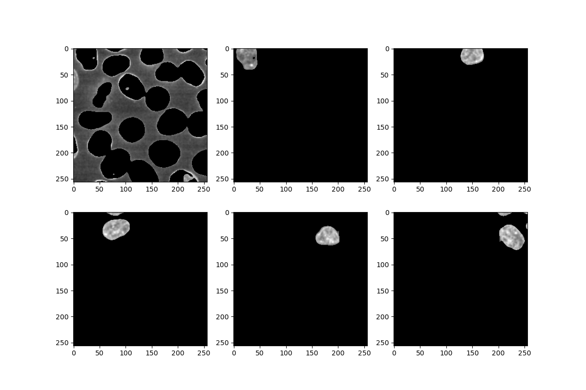

:::::::::::::::::::::::::::::::::::::: questions 
- How can I make useful measurements in my image?
::::::::::::::::::::::::::::::::::::::::::::::::

::::::::::::::::::::::::::::::::::::: objectives
- Find the mean pixel intensity in each nucleus
- Find the area of each nucleus
::::::::::::::::::::::::::::::::::::::::::::::::

Having isolated individual nuclei in the example image in the previous chapter, we
can make some observations about the image features. The exercises here will
require:

- Your masked watershed transformation from the previous chapter
- Your original smoothed image from exercise 9

### Processing one nucleus at a time

Remember that each nucleus is labelled with a unique number, so we use masking to
select a single nucleus. We can construct a binary mask from a labelled image
using numpy's [where function](https://numpy.org/doc/stable/reference/generated/numpy.where.html):

```python
from numpy import where

nucleus_1 = where(masked_watershed == 1, 1, 0)
nucleus_2 = where(masked_watershed == 2, 1, 0)
```

Here, each pixel will be set to either 1 or 0 depending on whether its value
matches the label we're looking for, effectively creating a **binary mask**
for each nucleus.

::::::::::::::::::::::::::::::::::::: challenge 
## Exercise 13: Quantifying intensities

For each labelled nucleus:

- Construct a binary mask matching the label number
- Use this to isolate the individual nucleus out of your **original smoothed image**
  - Hint: try looking at the [`numpy.where`](https://numpy.org/doc/stable/reference/generated/numpy.where.html)
    docs to see the different ways it can be used.
- Find the mean pixel value for the nucleus

:::::::::::::::::::::::: solution
First, we need to know how many features we're looping over. We can get that from the
numbers that the labelling process provides - if your labelled image contains the
labels 1, 2 and 3, then you have 3 features.

Next, we need to generate a mask for that feature using `numpy.where`, that will
allow us to mask out the original image - in this case, either a corresponding
pixel value from the original image or `None`. We can then take the result of that,
select all pixels that are not `None` and use `numpy.mean`.

```python
plt.figure(figsize=(12, 8))
labels = sorted(set(masked_watershed.flatten()))

for i in labels[:6]:  # just showing the first 6
    mask = numpy.where(masked_watershed == i, 1, 0)
    nucleus = numpy.where(mask == 1, image, 0)
    plt.subplot(2, 3, i + 1)  # subplot counts from 1 rather than 0
    plt.imshow(nucleus)
    pixels = [p for p in nucleus.flatten() if p]  # remove the background pixels
    print('Feature ' + str(i) + ':', numpy.mean(pixels))
```

{alt='Mean intensities'}

A few notes:

- Note how the first feature labelled as `0` corresponds to the background
- Remember that in `subplot`, we need to offset the subplot number by +1, since it counts from 1
- In the first `numpy.where` above, we supply two single numbers, 1 and 0, giving us a binary mask.
  In the next one, we provide an n-dimensional array instead, causing it to instead select the
  value of the corresponding pixel.
:::::::::::::::::::::::::::::::::
:::::::::::::::::::::::::::::::::::::::::::::::

::::::::::::::::::::::::::::::::::::: keypoints 
- Binary multiplication and `numpy.where` are powerful ways of combining images and masks
- The numbers assigned during labelling can be used to select and process one feature at a time
::::::::::::::::::::::::::::::::::::::::::::::::
