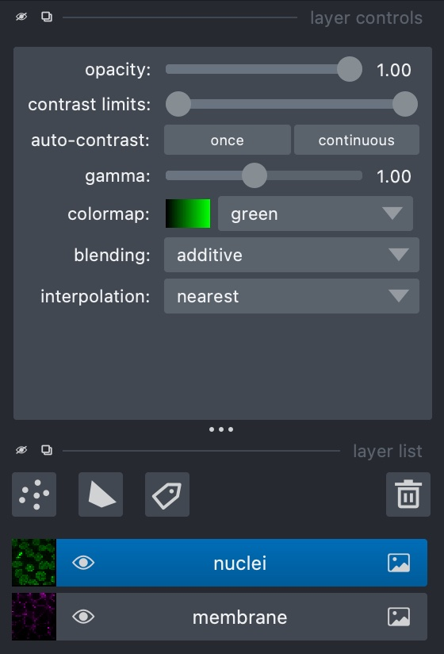
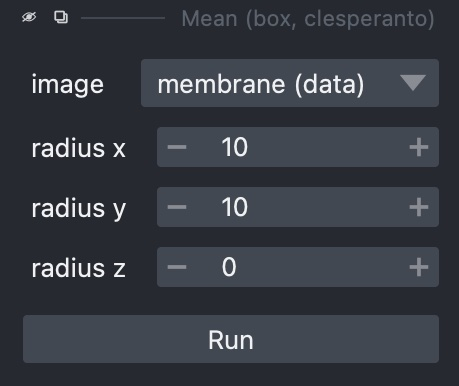
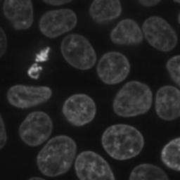
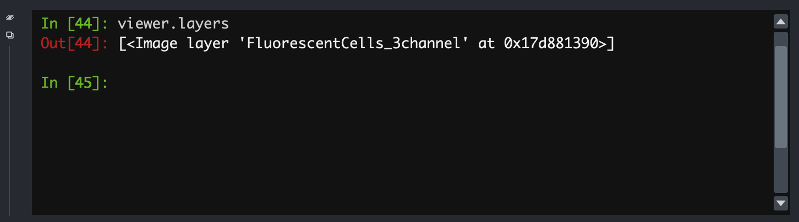

:::::::::::::::::::::::::::::::::::::: questions 
- How can I view images and metadata in Napari?
::::::::::::::::::::::::::::::::::::::::::::::::

::::::::::::::::::::::::::::::::::::: objectives
- Open and explore some images and compare the process
  of doing the same process in Python
::::::::::::::::::::::::::::::::::::::::::::::::

## Starting Napari

With Napari installed and its Conda environment active, run:

    napari

This will start up Napari in a new window. This may take about a minute, especially
the first time.


## Looking around

In the 'File' menu, go to 'Open Sample -> napari builtins -> Cells (3D+2Ch)'. Looking
at the sidebar, Napari has opened two **layers** - 'membrane' and 'nuclei'. At the top
of the sidebar there are options for displaying layers in different colours and opacity,
and the eye symbol on the layer can be checked or unchecked to show/hide it:

{alt='Napari layers'}

Napari uses layers to represent each stage of processing an image - we run tools to
create new processed layers based off of a previous one. In this example, the image
consists of two channels, each of which has been loaded as a layer.

In the case of z-stack or time series images such as this one, there is also a slider
at the bottom for scrolling through the layers.

::::::::::::::::::::::::::::::::::::: challenge 
## Exercise 14: Napari tools

With 'Cells (3D + 2Ch)' open, go to 'Tools -> Filtering / Noise Removal' and
look at the options available. What are these options? What happens if you
select one and try running it on a layer?

:::::::::::::::::::::::: solution 
The options here consist of smoothing filters, several of which will be familiar
from previous chapters. In some cases there are multiple versions of a filter
(e.g. there are three Gaussian filters), each of which uses a different
Python library.

Selecting one of these gives a sidebar letting us choose how to run it, including
which layer to use, plus any extra parameters it may take, such as sigma values
for Gaussian filters:

{alt='Gaussian filter controls'}

{alt='Gaussian filter'}

:::::::::::::::::::::::::::::::::
:::::::::::::::::::::::::::::::::::::::::::::::


## Loading real-world images

The example images work nicely with Napari, but sometimes it may be more difficult to
coax Napari into loading an image correctly. In 'File', select 'Open File(s)...'
and load up FluorescentCells_3channel.tif. Doing this, we find the results aren't
quite what we expect - the three channels have been loaded as if they're a z-stack.

Fortunately, Napari includes a Python console that gives us very fine-grained control
of the user interface, and will let us load this image correctly. In the bottom
left, use the '>_' button to open a terminal. This activates a Python session
where Napari is represented as an object called `viewer`:

{alt='Napari Python console'}

- All the loaded layers are in a list called `viewer.layers`
- Within a layer, the image data is an attribute called `data`

In this console, we can create new layers with `viewer.add_image`. First, let's look
at the image's shape:

```python
from skimage.io import imread
iage = imread('path/to/FluorescentCells_3channel.tif')
image.shape
# returns: (512, 512, 3)
```

From this, we can see that the colour channels are the third axis. Using this,
We can now load each channel as a new layer:

```python
viewer.add_image(image[:, :, 0], name='FluorescentCells_ch0', colormap='red')
viewer.add_image(image[:, :, 1], name='FluorescentCells_ch1', colormap='green', blending='additive')
viewer.add_image(image[:, :, 2], name='FluorescentCells_ch2', colormap='blue', blending='additive')
```

The `blending='additive'` option prevents layers on top from obscuring layers below it
so that we can view multiple layers at once. We also use `colormap` to colour the layers so we
can distinguish them from each other.

`viewer.add_image` is also able to load all these layers in one if we tell it which axis
represents the colour channels:

```python
viewer.add_image(image, name='FluorescentCells', channel_axis=2)
```

::::::::::::::::::::::::::::::::::::: challenge 
## Exercise 15: Real world images

- Go to 'File' -> 'Open File(s)...' and load the image 'confocal-series_zstack.tif'. How
  does it look? Can you view each channel simultaneously?
- Now try loading the same image in the console as above, looking at the image's shape and
  passing the channel axis to `viewer_add_image`.
  axis looks like the channels. How has the fourth axis been represented?

:::::::::::::::::::::::: solution
Loading the image from the menu, we can see some results but it's all in one layer and the
channel axis is represented as a slider, meaning we can't view the two at the same time.

As an alternative, we can load the image in the Python console:

```python
image = skimage.io.imread('path/to/confocal-series_zstack.tif')
image.shape
# returns: (25, 2, 400, 400)
```

The second number, i.e. `image.shape[1]` looks like the channel axis. We can then
provide this when loading the image:

```python
viewer.add_image(image, name='FluorescentCells', channel_axis=1)
```

Napari will load the image as two coloured layers, with the Z axis represented via the slider
at the bottom.
:::::::::::::::::::::::::::::::::
:::::::::::::::::::::::::::::::::::::::::::::::

::::::::::::::::::::::::::::::::::::: challenge

## Exercise 16: Image segmentation in the Napari console

This exercise will put together everything that has been covered in previous
chapters, and apply the same steps in the Napari console.

Look at the 'nuclei' layer of 'Cells (3D + 2Ch)'. In the Python console, try doing the
same smoothing, binarisation, segmentation and labelling that you performed throughout
exercises 6-12, except displaying each step as a new layer in the Napari viewer.

Remember that instead of `matplotlib.pyplot.imshow()`, you'll need to use `viewer.add_image()`

:::::::::::::::::::::::: solution
```python
import skimage

image = skimage.io.cells3d()
image.shape
# returns: (60, 2, 256, 256)

frame = image[30, 1, :, :]
smoothed_image = skimage.filters.gaussian(frame, sigma=1)
viewer.add_image(smoothed_image, name='smoothed')

threshold = skimage.filters.threshold_otsu(smoothed_image)
binary_image = smoothed_image > threshold
viewer.add_image(binary_image, name='Otsu threshold')

import scipy.ndimage
fill_holes = scipy.ndimage.binary_fill_holes(binary_image)
viewer.add_image(fill_holes, name='fill_holes')

distance_transform = scipy.ndimage.distance_transform_edt(fill_holes)
viewer.add_image(distance_transform, name='distance_transform')

coords = skimage.feature.peak_local_max(skimage.filters.gaussian(distance_transform, sigma=4), labels=fill_holes)

import numpy
mask = numpy.zeros(distance_transform.shape, dtype=bool)
mask[tuple(coords.T)] = True
markers = skimage.morphology.label(mask)
viewer.add_image(markers, name='peaks')

watershed_transform = skimage.segmentation.watershed(-distance_transform, markers)
viewer.add_image(watershed_transform, name='watershed')

masked_watershed = watershed_transform * fill_holes
viewer.add_image(masked_watershed, name='masked_watershed')
```
:::::::::::::::::::::::::::::::::
::::::::::::::::::::::::::::::::::::::::::::::::

## Image segmentation with Napari tools

Aside from running analyses in the Python console, Napari has a variety of processing steps that can
be browsed under 'Tools'.

For example, we can go to 'Open Sample' -> 'napari builtins' and  -> 'Binary Blobs'. Browse the tools available and run:

- Otsu threshold
- Split touching objects (nsbatwm). Try experimenting with different sigma values until you get some good cell separations.
- Connected component labelling (scikit-image, nsbatwm)

Note: The Otsu threshold shouldn't be required since the test image is already a binary, but for some reason the 'Split
touching objects' Napari tool isn't able to recognise the original as a binary image.

::::::::::::::::::::::::::::::::::::: challenge

## Exercise 17: Exporting code

This exercise will see how the processing that we have built up with Napari tools
can be exported back to Python code that we can then check into version control
and integrate into a workflow to help automate the processing of many images.

Under 'Plugins', open the Napari Assistant and find the 'Export Python code'
tool. Use this to generate a Python script that will perform
the processing that you just performed above on the Binary Blobs
image. Does the script look usable immediately without modification?

:::::::::::::::::::::::: solution
There are several options to export in different ways, including to
a Jupyter notebook. The simplest way is probably to copy to clipboard -
this can be pasted into a text editor or IDE:

```python
from skimage.io import imread
import napari_segment_blobs_and_things_with_membranes as nsbatwm  # version 0.3.6
import napari
if 'viewer' not in globals():
    viewer = napari.Viewer()

image0_bb = viewer.layers['binary_blobs'].data

# threshold otsu

image1_to = nsbatwm.threshold_otsu(image0_bb)
viewer.add_labels(image1_to, name='Result of threshold_otsu')

# split touching objects

image2_sto = nsbatwm.split_touching_objects(image1_to, 5.6)
viewer.add_labels(image2_sto, name='Result of split_touching_objects')

# connected component labeling

image3_ccl = nsbatwm.connected_component_labeling(image2_sto, False)
viewer.add_labels(image3_ccl, name='Result of connected_component_labeling')
```

Looking at it, we can see that it's not immediately usable but it's pretty close.
Exported scripts do not make any reference to what image file was loaded,
and there is no code at the end for writing the resuults to a file, so this is what
you would need to add to get it to produce tangible output.

:::::::::::::::::::::::::::::::::

::::::::::::::::::::::::::::::::::::::::::::::::

::::::::::::::::::::::::::::::::::::: keypoints 
- Napari works with layers, each of which represents an image channel
- Napari doesn't always know how to load a multi-channel image from the GUI
- We can use the Python console to perform custom operations that can't be
  done in the GUI
- Most operations we performed earlier in Python can also be done in Napari,
  either graphically or in the terminal
::::::::::::::::::::::::::::::::::::::::::::::::
